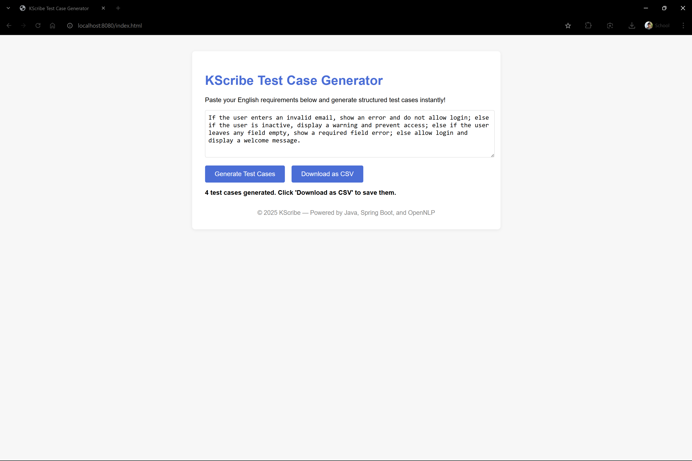
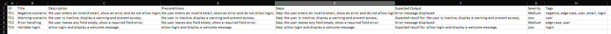

# KScribe

**From requirement to test case in seconds**

KScribe is a backend-powered Java + Spring Boot application that uses NLP (OpenNLP) to automatically generate structured test cases from natural language requirements. It demonstrates advanced logic handling (if/then/else, negation, edge cases) and is designed for real-world QA automation, demos, and extensibility.

---

## 🚀 Project Highlights
- **Transforms English requirements into actionable test cases**
- **Handles complex logic:** if/then/else, negation, edge cases, multi-action
- **REST API:** JSON and CSV output for easy integration
- **Spring Boot + OpenNLP:** Modern, scalable, and production-ready
- **Extensible:** Easily add more NLP, LLM, or frontend features

---

## 🧰 Tech Stack
- Java 17+
- Spring Boot
- Apache OpenNLP
- Jackson, Lombok, OpenCSV
- JUnit/Mockito (for testing)

---

## 📝 Features
- Accepts raw, unstructured English requirements (API)
- NLP processing: Tokenization, POS tagging, lemmatization
- Extracts actions, entities, conditions, and expected results
- Generates structured test cases (ID, title, description, steps, expected output, etc.)
- Outputs as JSON or downloadable CSV
- Handles negation, conditionals, and edge cases

---

## ⚡ Quick Start
1. **Clone the repo**
2. **Download OpenNLP models** (`en-token.bin`, `en-sent.bin`, `en-pos-maxent.bin`, `en-lemmatizer.bin`) and place in `src/main/resources/nlp-models/`
3. **Build and run:**
   ```bash
   mvn clean install
   mvn spring-boot:run
   ```
4. **Open the frontend:**
   - Go to [http://localhost:8080/index.html](http://localhost:8080/index.html) in your browser.
5. **Test the API (optional):**
   ```bash
   curl -X POST http://localhost:8080/api/requirements/to-testcases -H "Content-Type: application/json" -d '[{"text": "If the user enters an invalid email, show an error; else proceed to dashboard."}]'
   ```
6. **CSV Output (optional):**
   ```bash
   curl -X POST http://localhost:8080/api/requirements/to-csv -H "Content-Type: application/json" -o testcases.csv -d '[{"text": "If the user enters an invalid email, show an error; else proceed to dashboard."}]'
   ```

---

## 🌐 Simple Frontend
A minimal web frontend is included for demo and user convenience. To use:
1. Open [http://localhost:8080/index.html](http://localhost:8080/index.html) in your browser
2. Paste your requirements and click "Generate Test Cases"
3. Click "Download as CSV" to save the results

---

## 📸 Screenshots




*Add screenshots or GIFs of the API and frontend in action here!*

---

## 📄 Example Input
```
If the user enters an invalid email, show an error; else proceed to dashboard.
```

## 🧪 Example Output
| ID  | Title                    | Steps                                 | Expected Result           |
|-----|--------------------------|---------------------------------------|--------------------------|
| TC1 | Negative scenario: the user enters an invalid email, show an error and do not allow login; | Step: the user enters an invalid email, show an error and do not allow login; | Error message displayed  |
| TC2 | Warning scenario         | Step: the user is inactive, display a warning and prevent access; | Expected result for: the user is inactive, display a warning and prevent access; |
| TC3 | Error handling           | Step: the user leaves any field empty, show a required field error; | Error message displayed  |
| TC4 | Validate login           | Step: allow login and display a welcome message. | Expected result for: allow login and display a welcome message. |

---

## License
MIT 